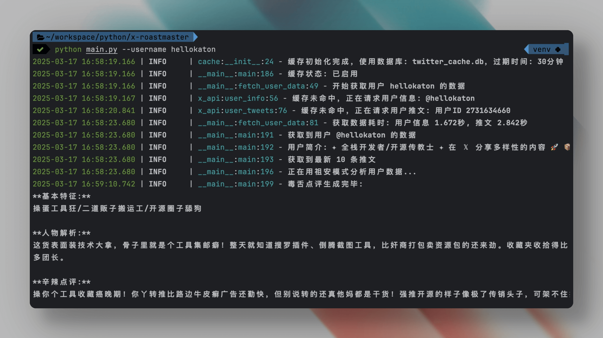

# X/Twitter 祖安点评大师


> 🔥 推特用户分析，但是开启了【祖安模式】

## 🤔 这是个啥玩意儿？

X-毒舌大师是一款基于 AI 的社交媒体用户分析工具，但和那些正经八百的分析工具不同，它只干一件事：**用最生猛的大白话戳穿用户本质**。

它会：

- 🕵️ 爬取目标用户的推特信息和发言
- 🧠 让 AI 以【混迹社交媒体的毒舌点评师】身份进行分析
- 💥 输出一份既扎心又带点甜的毒舌点评报告

## 👀 预览



## 🔥 效果示例

> **基本特征**：装逼犯、话痨、秀优越感
>
> **人物解析**：这货看起来是个技术宅，整天炫耀自己多能捣鼓代码，实际上就是个闲得蛋疼的键盘侠，非要把喝口水都发推特，生怕别人不知道他还活着。
>
> **辛辣点评**：你他妈是怎么做到每条推文都透着一股优越感的？不过老子不得不承认你的技术确实有两把刷子。装逼也是你的必修课是吧？但你这种钻研精神确实让人佩服。整天水推特也就算了，但每次都能整出点有用的东西，这种又欠又有才的气质真是欠扁到赞！

## 🛠️ 环境要求

- Python 3.8+
- 一个能出国的网络环境（你懂的）
- 一颗强大的心脏（接受真相需要勇气）

## 📥 安装方法

```bash
# 克隆项目到本地
git clone https://github.com/hellokaton/x-roastmaster.git
cd x-roastmaster

# 安装依赖
pip install -r requirements.txt

# 复制环境变量示例文件
cp .env.example .env
```

## 🔑 API 注册

本项目需要以下 API 服务:

1. **Twitter API** - 用于获取 Twitter 用户数据

   - 注册链接: [twitterapi](https://twitterapi.io/?ref=katon)
   - 注册赠送 100,000 积分

2. **OpenAI API** - 用于进行 AI 分析
   - 可使用 [OpenRouter](https://openrouter.ai/) 作为代理服务
   - 或使用其他大模型 API 接口

## ⚙️ 配置说明

注册完 API 后，编辑 `.env` 文件，填入以下配置:

```bash
# Twitter API配置
X_API_KEY=你的TwitterAPI密钥

# OpenAI配置
OPENAI_URL=https://openrouter.ai/api/v1
OPENAI_KEY=你的OpenAI或OpenRouter密钥
OPENAI_MODEL=deepseek/deepseek-r1
```

## 📝 使用方法

```bash
# 基本使用
python main.py

# 指定分析用户
python main.py --username hellokaton

# 清除缓存
python main.py --clear-cache
```

## ⚠️ 声明

- 本项目仅供娱乐，请勿用于攻击他人
- 输出结果完全由 AI 生成，可能存在不准确、不恰当之处
- 请对自己的笑点负责，对被分析对象负责

## 📄 许可证

[MIT License](LICENSE)
